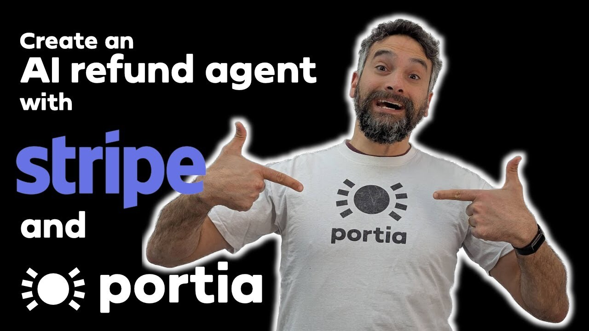

<p align="center">
    <a href="https://docs.portialabs.ai/steel-thread-intro">
       
    </a></br>
<strong>Our flexible evaluation framework is out!</strong></br>
  🧪 Ingest test cases directly from your agent runs rather than building datasets from scratch.</br>
  🛰️ Monitor in real-time or with offline evals.</br>
  📊 Use custom metric definitions including both deterministic and LLM-based judging.</br></br>
</p>

---

<p align="center">
  <picture>
    <source media="(prefers-color-scheme: dark)" srcset="assets/Logo_Portia_Line_White.png">
    <source media="(prefers-color-scheme: light)" srcset="assets/Logo_Portia_Line_Black.png">
    
  </picture>
</p>
<p align="center">
  <a href="https://github.com/mahseema/awesome-ai-tools">
    
  </a>
</p>

<p align="center">
  <a href="https://www.youtube.com/@PortiaAI">
    
  </a>
  <a href="https://discord.gg/DvAJz9ffaR">
    
  </a>
  <a href="https://x.com/RealPortiaAI">
    
  </a>
  <a href="https://www.reddit.com/r/PortiaAI/">
    
  </a>
  <a href="https://www.linkedin.com/company/portiaai">
    
  </a>
  <br>
  <a href="https://app.portialabs.ai">
    
  </a>
  <a href="https://docs.portialabs.ai">
    
  </a>
  <a href="https://blog.portialabs.ai">
    
  </a>
</p>

<p align="center">
  <a href="https://www.producthunt.com/products/portia-ai?embed=true&utm_source=badge-top-post-badge&utm_medium=badge&utm_source=badge-portia&#0045;ai&#0045;2" target="_blank">
    
  </a>
</p>

# Portia SDK Python

Portia AI is an open source developer framework for predictable, stateful, authenticated agentic workflows. We allow developers to have as much or as little oversight as they’d like over their multi-agent deployments and we are obsessively focused on production readiness.
Play around, break things and tell us how you're getting on in our <a href="https://discord.gg/DvAJz9ffaR" target="_blank">**Discord channel (↗)**</a>. Most importantly please be kind to your fellow humans (<a href="https://github.com/portiaAI/portia-sdk-python/blob/main/CODE_OF_CONDUCT.md" target="_blank" rel="noopener noreferrer">**Code of Conduct (↗)**</a>).

If you want to dive straight in with an example, dive into one of our examples in our **[Examples Repo (↗)](https://github.com/portiaAI/portia-agent-examples)**.

## Key features

**Iterate on agents’ reasoning and intervene in their execution**</br>
🧠 Create your multi-agent [`Plan`](https://docs.portialabs.ai/generate-plan) conversationally, or build them with our [`PlanBuilder`](https://docs.portialabs.ai/generate-plan#build-a-plan-manually).</br>
📝 Enrich a [`PlanRunState`](https://docs.portialabs.ai/run-plan) during execution to track progress.</br>
🚧 Define inputs and output structures for enhanced predictability.</br>
✋🏼 Add deterministic tasks through an [`ExecutionHook`](https://docs.portialabs.ai/execution-hooks). Use a [`clarification`](https://docs.portialabs.ai/understand-clarifications) for human:agent interactions.</br>

**Extensive tool support including MCP support**</br>
🔧 Connect [tool registries](https://docs.portialabs.ai/extend-run-tools) from any MCP server, local tools or another AI tool provider (e.g. ACI.dev).</br>
🫆 Leverage Portia cloud's prebuilt [1000+ cloud and MCP tools](https://docs.portialabs.ai/cloud-tool-registry) with out-of-the-box authentication.</br>
🌐 Navigate the web and cope with captchas and logins using our [open source browser tool](https://docs.portialabs.ai/browser-tools).</br>

**Authentication for API and web agents**</br>
🔑 Handle user credentials seamlessly, for both API tools and browser sessions, with our `clarification` interface.</br>

**Production ready**</br>
👤 Attribute multi-agent runs and auth at an [`EndUser`](https://docs.portialabs.ai/manage-end-users) level.</br>
💾 Large inputs and outputs are automatically stored / retrieved in [Agent memory](https://docs.portialabs.ai/agent-memory) at runtime.</br>
🔗 Connect [any LLM](https://docs.portialabs.ai/manage-config#configure-llm-options) including local ones, and use your own Redis server for [caching](https://docs.portialabs.ai/manage-config#manage-caching).</br>

<p align="center"><strong>🌟 Star Portia AI to stay updated on new releases!</strong></p>

## Demo
To clickthrough at your own pace, please follow this [link](https://snappify.com/view/3d721d6c-c5ff-4e84-b770-83e93bd1a8f1)</br>


## Quickstart

### Installation in 3 quick steps

Ensure you have python 3.11 or higher installed using `python --version`. If you need to update your python version please visit their [docs](https://www.python.org/downloads/). Note that the example below uses OpenAI but we support other models as well. For instructions on linking other models, refer to our [docs](https://docs.portialabs.ai/manage-config).</br>

**Step 1:** Install the Portia Python SDK
```bash
pip install portia-sdk-python 
```

**Step 2:** Ensure you have an LLM API key set up
```bash
export OPENAI_API_KEY='your-api-key-here'
```
**Step 3:** Validate your installation by submitting a simple maths prompt from the command line
```
portia-cli run "add 1 + 2"
```

**All set? Now let's explore some basic usage of the product 🚀**

### E2E example
You will need a Portia API key* for this one because we use one of our cloud tools to schedule a calendar event and send an email. 
<br>**🙏🏼 *We have a free tier so you do not need to share payment details to get started 🙏🏼.**<br>
Head over to <a href="https://app.portialabs.ai" target="_blank">**app.portialabs.ai (↗)**</a> and get your Portia API key. You will then need to set it as the env variable `PORTIA_API_KEY`.<br/>

The example below introduces **some** of the config options available with Portia AI (check out our <a href="https://docs.portialabs.ai/manage-config" target="_blank">**docs (↗)**</a> for more):
- The `storage_class` is set using the `StorageClass.CLOUD` ENUM. So long as your `PORTIA_API_KEY` is set, runs and tool calls will be logged and appear automatically in your Portia dashboard at <a href="https://app.portialabs.ai" target="_blank">**app.portialabs.ai (↗)**</a>.
- The `default_log_level` is set using the `LogLevel.DEBUG` ENUM to `DEBUG` so you can get some insight into the sausage factory in your terminal, including plan generation, run states, tool calls and outputs at every step 😅
- The `llm_provider` and `xxx_api_key` (varies depending on model provider chosen) are used to choose the specific LLM provider. In the example below we're using GPT 4o, but you can use Anthropic, Gemini and others!

Finally we also introduce the concept of a `tool_registry`, which is a flexible grouping of tools.

```python
from dotenv import load_dotenv
from portia import Config, Portia, DefaultToolRegistry
from portia.cli import CLIExecutionHooks

load_dotenv(override=True)

recipient_email = input("Please enter the email address of the person you want to schedule a meeting with:\n")
task = f"""
Please help me accomplish the following tasks:
- Get my availability from Google Calendar tomorrow between 8:00 and 8:30
- If I am available, schedule a 30 minute meeting with {recipient_email} at a time that works for me with the title "Portia AI Demo" and a description of the meeting as "Test demo".
"""

config = Config.from_default()
portia = Portia(
   config=config,
   tools=DefaultToolRegistry(config=config),
   execution_hooks=CLIExecutionHooks(),
)

plan = portia.run(task)
```

### Advanced examples on YouTube
Here is an example where we build a customer refund agent using Stripe's MCP server. It leverages execution hooks and clarifications to confirm human approval before moving money.</br>
[](https://youtu.be/DB-FDEM_7_Y?si=IqVq14eskvLIKmvv)

Here is another example where we use our open browser tool. It uses clarifications when it encounters a login page to allow a human to enter their credentials directly into the session and allow it to progress.</br>
[](https://youtu.be/hSq8Ww-hagg?si=8oQaXcTcAyrzEQty)

## Learn more
- Head over to our docs at <a href="https://docs.portialabs.ai" target="_blank">**docs.portialabs.ai (↗)**</a>.
- Join the conversation on our <a href="https://discord.gg/DvAJz9ffaR" target="_blank">**Discord channel (↗)**</a>.
- Watch us embarrass ourselves on our <a href="https://www.youtube.com/@PortiaAI" target="_blank">**YouTube channel (↗)**</a>.
- Follow us on <a href="https://www.producthunt.com/posts/portia-ai" target="_blank">**Product Hunt (↗)**</a>.

## Paid contributions & contribution guidelines
Head on over to our <a href="https://github.com/portiaAI/portia-sdk-python/blob/main/CONTRIBUTING.md" target="_blank">**contribution guide (↗)**</a> for details.

Portia offers a **PAID** contribution program by fixing issues on our 'Issues' list. You can read all about this in the <a href="https://github.com/portiaAI/portia-sdk-python/blob/main/CONTRIBUTING.md" target="_blank">**contribution guide (↗)**</a>.

# ⭐ Support
You can support our work best by leaving a star!


We love feedback and suggestions. Please join our <a href="https://discord.gg/DvAJz9ffaR" target="_blank">**Discord channel (↗)**</a> to chat with us.
